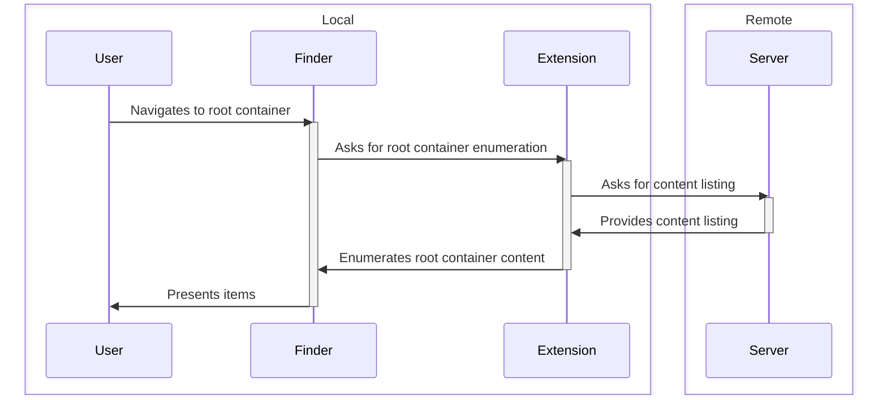

#  Nextcloud Desktop Client End-to-End Tests on macOS

> [!NOTE]
> This only is a personal experiment for now.

This is an Xcode project with a conventional UI tests target.
It uses macOS accessibility features to automatically control the Nextcloud desktop client and macOS Finder which is set up to run against a live Nextcloud test server.

The end goal is to run this parallelized in virtual macOS machines with the same client build and various Nextcloud server deployments as backends.

## Preconditions

- The latest supported major **Xcode** release must be installed in the test environment.
- **English (US)** is set as the system language in the test environment. This is required to match user interface elements based on their text labels. Not all of them, including first-party apps, have accessibility identifiers defined.
- **Light appearance** is defined for macOS. 
- These tests assume that there is one client app bundle to test at `/Applications/Nextcloud.app` and only verifies that its version equals the expected version specified through an argument or environment variable.
- These tests assume that there is one Nextcloud server to run against which is specified through an argument or an environment variable, including the account details.

## Out of Scope

- **Building the subject under test.** The Nextcloud desktop client is built the with the latest major Xcode release on the latest major macOS release regardless of targeted macOS release. Hence the same build can be reused in all test runs. This is also one of the reasons why this project is decoupled from the actual client project. 
- **Managing different Nextcloud server versions or client versions.** That is responsibility of a higher layer project which uses this one to run different client versions against different server versions on different macOS releases. Though, that layer still needs to be implemented, so it might also end up as part of this repository.

## Test Matrix

The environments to test are based on [the officially supported Nextcloud server releases](https://github.com/nextcloud/server/wiki/Maintenance-and-Release-Schedule) and every major macOS release the desktop client officially supports.
As of writing, the test matrix looks like this:

| macOS        | Nextcloud 32 | Nextcloud 33 |
|--------------|--------------|--------------|
| 13 (Ventura) |              |              |
| 14 (Sonoma)  |              |              |
| 15 (Sequoia) |              |              |
| 26 (Tahoe)   |              |              |

## Contributing

Every test implementation should have a documentation comment which explains the test in natural language. At best, it also includes Mermaid sequence diagrams.

## License
 
 See [LICENSE](LICENSE).
